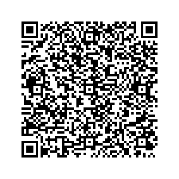

# DLNET
This is a small project that solves an issue when dealing with QR codes and security related issues when moving them.

More and more projects especially in the crypto space use QR codes for logging in or convey information.
However! It is usually very difficult without the use of external applications to get a QR code safely from 
one machine to the other.

The only requirement is that the receiving machine has a camera. Only visual information is used to convey information.

* QR Code AAA contains some information that is generated on device one. Device one can download the QR code and potentially upload it later but device two doesn't have access to this information.
* Device one generates an a QR code that points to an IPFS hosted application that everything after the pound/hash sign (#). This part will never leave your browser. The part after the HASH sign contains information like the filename and the QR code size.
* It also contains the AES encrypted information that you want to send to device two and a hashed random number for decryption key validation.
* Device one creates a second QR code that has the AES key and encrypted random number.
* Device two now scans QR code one, it gets directed to the IPFS hosted page.
* The IPFS page will interpret the data and if encrypted will prompt for a key. Device two can now scan QR code two to decrypt the information that was send (and is present in browser history).
* Once scanned it creates the AAA QR code with the given information and downloads it with the filename provided in the first QR code.

Below an example on how to convey a QR code that contains 'Hello world!' in a safe way to any device with only a camera and internet (which is only required to download the page from IPFS).

100% decentralized!

### Scan this first: 

### When asked scan this following code

Now you received your Hello World QR code!

## Add this page to IPFS!
    ipfs pin QmXLmVTka5YHJpX7vomGEUrhZGDMQXz2RSBNVGinuaXHf2
